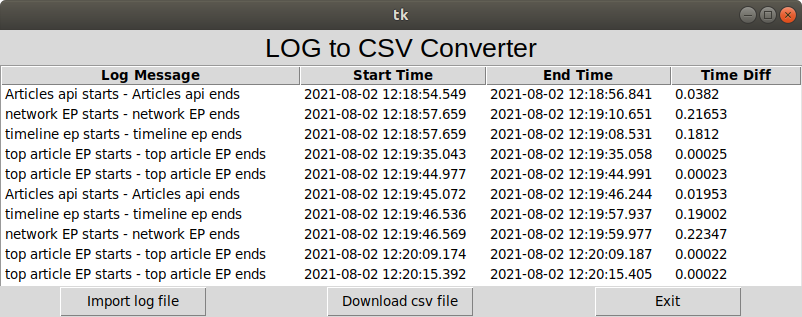
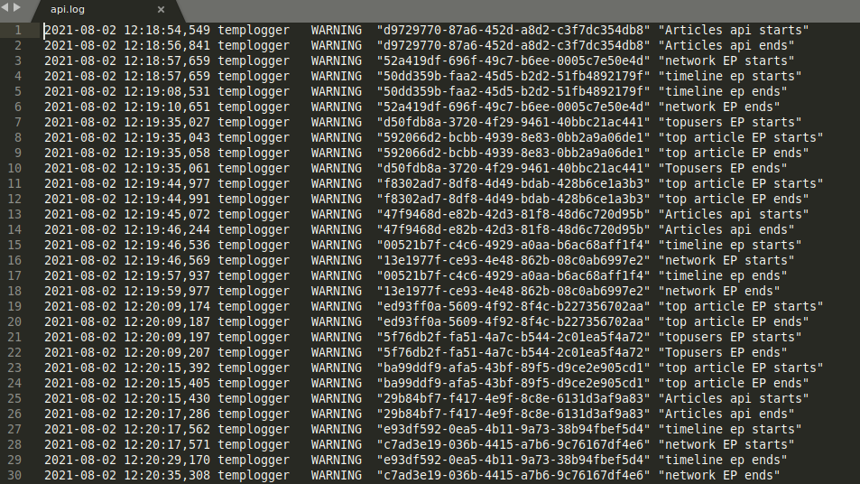

# Python application that converts a log file to a csv file

This application only converts the log file with follow format:

### Required package
pandas  
csv  
datetime  
tkinter

### Linux command to run the program
python3 app.py

